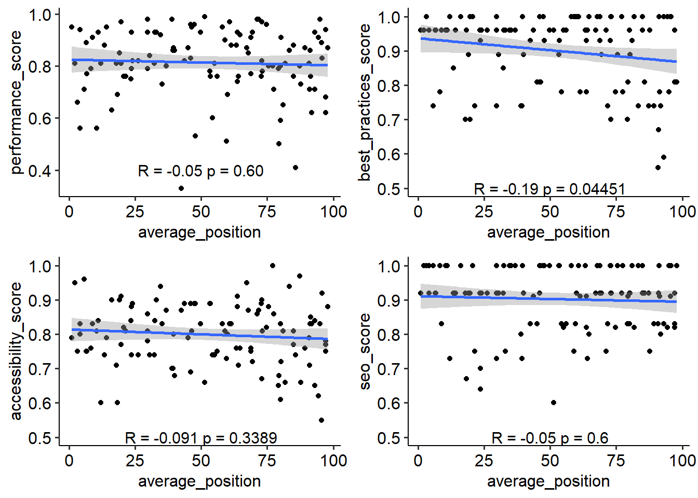
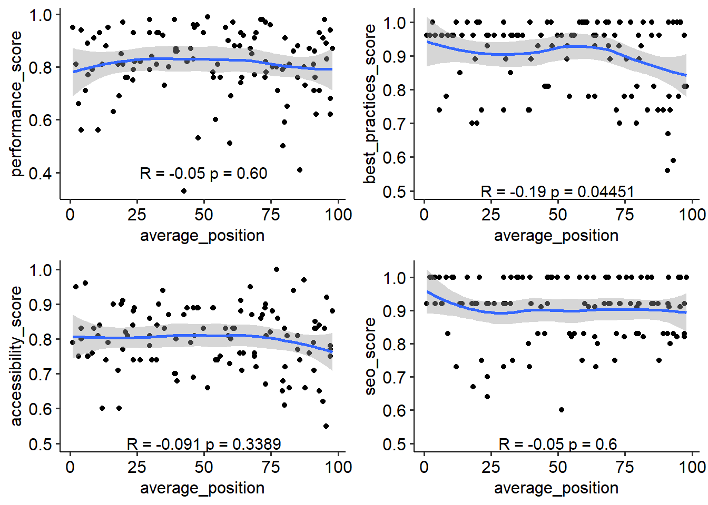
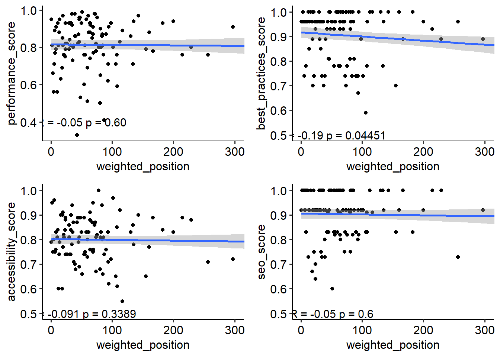
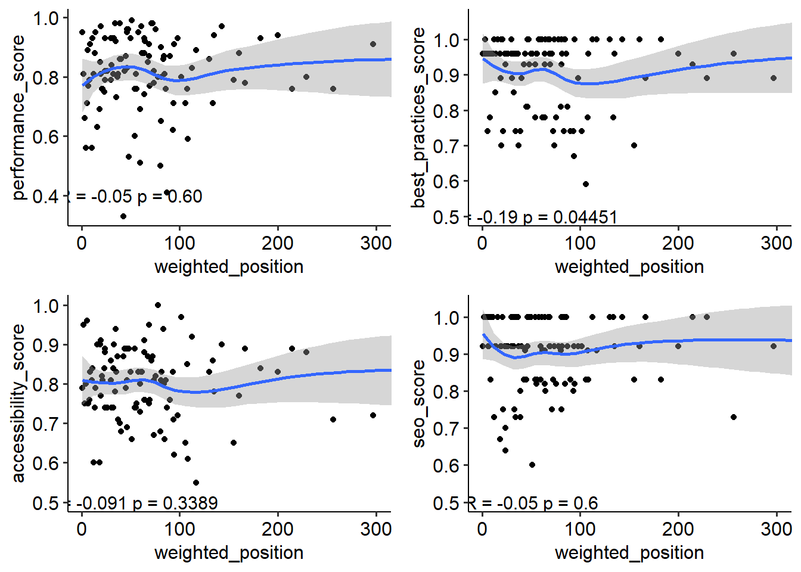

# Badanie korelacji między głównymi wskaźnikami optymalizacji stron internetowych a ich pozycją w wynikach wyszukiwania. Na przykładzie stron warszawskich serwisów rowerowych.

### Cel projektu

Sprawdzenie jak parametry, takie jak wydajność strony, dostępność, bezpieczeństwo i optymalizacja treści strony, wpływają na jej pozycję w wynikach wyszukiwania w Google.

### Zbieranie danych

Zdecydowaliśmy się na zebranie 100 pierwszych wyników wyszukiwania dla zapytania **serwis rowerowy warszawa**. Zależy nam, aby wyniki wyszukiwania były zróżnicowane, tzn. aby nie było wśród nich dominacji dużych portali ogólnopolskich lub wyników z mediów społecznościowych. Dzięki użyciu zapytania z lokalizacją oraz wybraniu branży, która faktycznie działa w jakiejś lokalizacji udało nam się uzyskać zróżnicowane wyniki.

Do przeprowadzenia agregacji korzystamy ze scrapera z platformy Apify, który wywoływany jest ze skryptu `wyniki_wyszukiwania_google.py`. Dzięki wykorzystaniu zewnętrznego narzędzia uniknęliśmy wpływu profilowania wyników wyszukiwania na urządzenie/wyszukiwarkę. Używając pętli, agregację powtarzamy 100 razy. Za każdym razem scraper zapisuje wyniki wyszukiwania do pliku JSON w folderze `Wyniki-wyszukiwania`. Nazwy plików zawierają datę i godzinę zapytania oraz jego treść.

### Przekształcanie danych

Z każdego zapisanego wyszukiwania w formacie JSON, dokonujemy ekstrakcji adresu URL oraz przypisanej mu pozycji. 

|url                                                                                                                                                 |average_position|url_count|weight|weighted_position|
|----------------------------------------------------------------------------------------------------------------------------------------------------|----------------|---------|------|-----------------|
|https://wygodnyrower.pl/serwis/serwis-rowerowy-warszawa/                                                                                            |1               |100      |1     |1                |
|https://3gravity.pl/pl/                                                                                                                             |2.04            |100      |1     |2.04             |
|https://www.centrumrowerowe.pl/sklep-rowerowy-warszawa/                                                                                             |3.08            |100      |1     |3.08             |
|https://skleprowerowy.pl/                                                                                                                           |4.16            |100      |1     |4.16             |
|https://warszawa.naszemiasto.pl/serwisy-rowerowe-w-warszawie-lista-warsztatow-gdzie-mozna-naprawic-rower-lub-zrobic-jego-przeglad/ar/c15p1-21631935 |5.69            |100      |1     |5.69             |
|https://sklep-naszosie.pl/                                                                                                                          |6.36            |100      |1     |6.36             |
|https://beatbike.pl/                                                                                                                                |6.61            |100      |1     |6.61             |
|https://sportset.pl/                                                                                                                                |8.24            |100      |1     |8.24             |
|https://wygodnyrower.pl/aktualnosci/%F0%9F%91%8Bnowy-sklep-i-serwis-wygodnyrower-bielany/                                                           |8.76|99       |0.99  |8.8562           |
|https://www.rowerywarszawa.pl/                                                                                                                      |10.34           |100      |1     |10.34            |

### Google Lighthouse

Do zbadania parametrów strony korzystamy z API narzędzia Google Lighthouse. To darmowe narzędzie do analizy wydajności i jakości stron internetowych.

Działanie Google Lighthouse obejmuje kilka głównych obszarów analizy:

1. **Wydajność (Performance):** Lighthouse mierzy wydajność strony, oceniając takie czynniki jak czas ładowania strony, opóźnienie pierwszego buforowania (First Contentful Paint), czas renderowania pierwszego krytycznego elementu (First Meaningful Paint) i inne metryki związane z ładowaniem strony.

2. **Dostępność (Accessibility):** Narzędzie analizuje dostępność strony internetowej dla użytkowników z różnymi ograniczeniami, takimi jak osoby korzystające z czytników ekranowych. Ocena obejmuje np. używanie poprawnych etykiet dla elementów, dostępność kontrastu kolorów, czy zrozumiałe informacje dla asystentów głosowych.

3. **Najlepsze praktyki (Best Practices):** Lighthouse sprawdza, czy strona internetowa stosuje się do ogólnie przyjętych najlepszych praktyk w projektowaniu i programowaniu stron. Obejmuje to kwestie takie jak zabezpieczenia, używanie najnowszych standardów, optymalizacje dla urządzeń mobilnych i inne.

4. **SEO (Search Engine Optimization):** Narzędzie analizuje elementy związane z optymalizacją dla wyszukiwarek internetowych. Oceniane są takie aspekty, jak czy strona ma odpowiednie meta-tagi, czy adresy URL są przyjazne dla wyszukiwarek, czy strona jest zaindeksowana i wiele innych.

Po analizie, Lighthouse generuje raport z wynikami, w którym przedstawia wyniki w postaci punktów procentowych dla każdego z obszarów oceny. Dzięki bezpośredniemu wywołaniu narzędzia przy pomocy API, jesteśmy w stanie otrzymać wyniki dla wszystkich badanych adresów. Wyniki zapisujemy w tabeli `lighthouse-output-full.csv`.

|url                                                                                                                                                 |weighted_position|performance_score|best_practices_score|accessibility_score|seo_score|
|----------------------------------------------------------------------------------------------------------------------------------------------------|-----------------|-----------------|--------------------|-------------------|---------|
|https://wygodnyrower.pl/serwis/serwis-rowerowy-warszawa/                                                                                            |1                |0.95             |0.96                |0.79               |0.92     |
|https://3gravity.pl/pl/                                                                                                                             |2.04             |0.81             |0.96                |0.95               |1        |
|https://www.centrumrowerowe.pl/sklep-rowerowy-warszawa/                                                                                             |3.08             |0.66             |1                   |0.75               |1        |
|https://skleprowerowy.pl/                                                                                                                           |4.16             |0.56             |0.96                |0.8                |1        |
|https://warszawa.naszemiasto.pl/serwisy-rowerowe-w-warszawie-lista-warsztatow-gdzie-mozna-naprawic-rower-lub-zrobic-jego-przeglad/ar/c15p1-21631935 |5.69             |0.71             |0.74                |0.96               |1        |
|https://sklep-naszosie.pl/                                                                                                                          |6.36             |0.89             |0.96                |0.75               |0.92     |
|https://beatbike.pl/                                                                                                                                |6.61             |0.77             |0.96                |0.75               |0.92     |
|https://sportset.pl/                                                                                                                                |8.24             |0.79             |0.78                |0.76               |1        |
|https://wygodnyrower.pl/aktualnosci/%F0%9F%91%8Bnowy-sklep-i-serwis-wygodnyrower-bielany/                                                           |8.8562           |0.91             |0.96                |0.83               |0.83     |
|https://www.rowerywarszawa.pl/                                                                                                                      |10.34            |0.56             |0.96                |0.81               |1        |

### Analiza bazy danych

Przystępujemy do wytworzonej wcześniej bazy danych. Naszym celem, będzie sprawdzenie korelacji pomiędzy poszczególnymi zmiennymi. W wyniku analizy docelowo chcemy znaleźć zmienne, które będą znacząco decydujące o pozycji strony w wyszukiwarce.

Przyjmując istotność alfa = 0,05 możemy stwierdzić, że korelacja zachodzi jedynie w przypadku zmiennej **best_practises**

#### Wykresy punktowe zależności między zmienną average_position, a poszczególnymi zmiennymi

#### Zmiana z linii regresji na linię trendu obliczoną na podstawie punktów na wykresach

#### Wykresy punktowe zależności między zmienną weighted_position, a poszczególnymi zmiennymi

#### Zmiana z linii regresji na linię trendu obliczoną na podstawie punktów na wykresach

### Konkluzje

Jak widać pomimo tego, że korelacja zachodzi tylko w przypadku zmiennej **best_practises_score**, to po wizualnej analizie wykresów można stwierdzić, że zmienna **seo_score** również ma znaczący wpływ na strony pozycjonowane najwyżej w wyszukiwaniach
